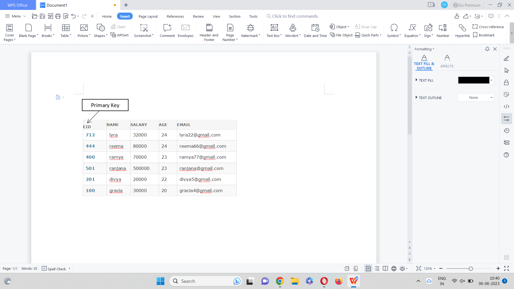
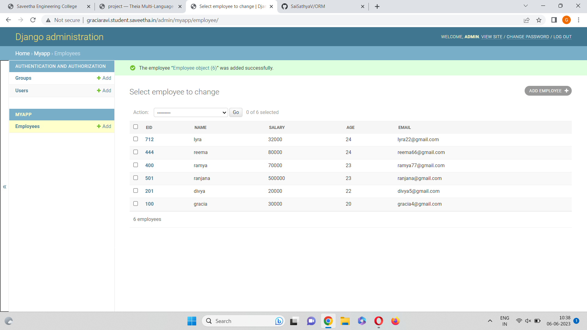

# Ex02 Django ORM Web Application

## AIM
To develop a Django application to store and retrieve data from a student database using Object Relational Mapping(ORM).

## Entity Relationship Diagram


## DESIGN STEPS

### STEP 1:
Clone the problem from github.

### STEP 2:
Create a new app.

### STEP 3:
Enter the code for admin.py and model.py

### STEP 4:
Execute Django admin and create 5 employees

## PROGRAM
```
admin.py

from django.contrib import admin
from .models import Employee,EmployeeAdmin
admin.site.register(Employee,EmployeeAdmin)

models.py

from django.db import models
from django.contrib import admin
class Employee (models.Model):
    eid=models.CharField(max_length=20,help_text="Employee ID")
    name=models.CharField(max_length=100)
    salary=models.IntegerField()
    age=models.IntegerField()
    email=models.EmailField()
 
class EmployeeAdmin(admin.ModelAdmin):
    list_display=('eid','name','salary','age','email')
```

## OUTPUT



## RESULT
The program for creating student database using ORM web application is completed successfully.